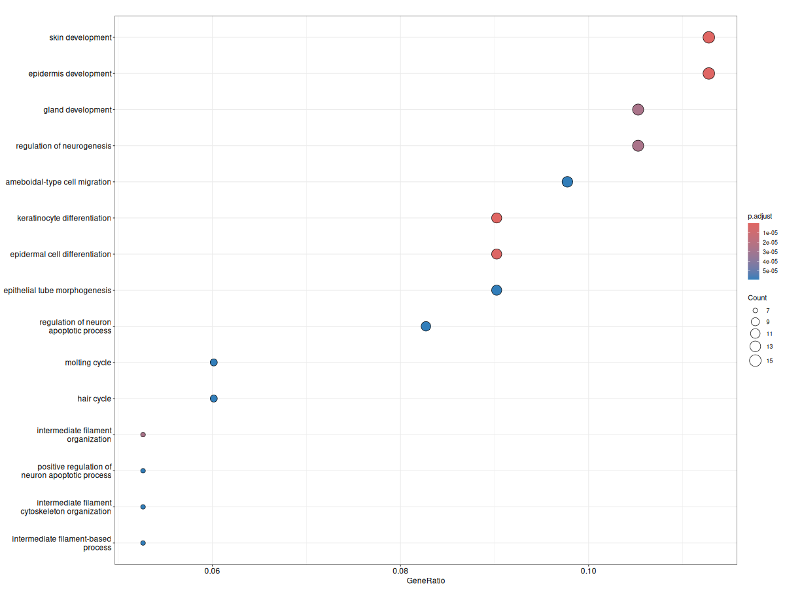
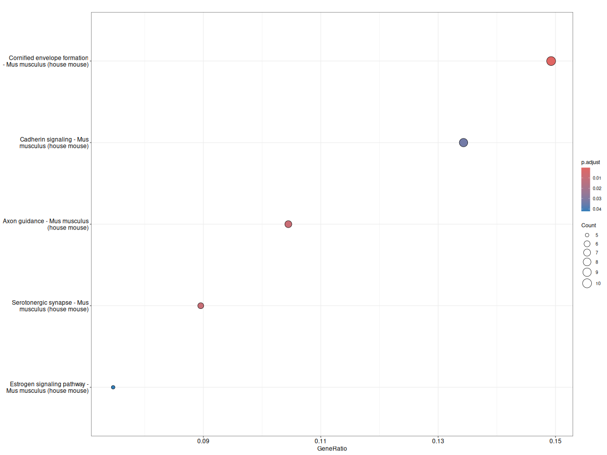
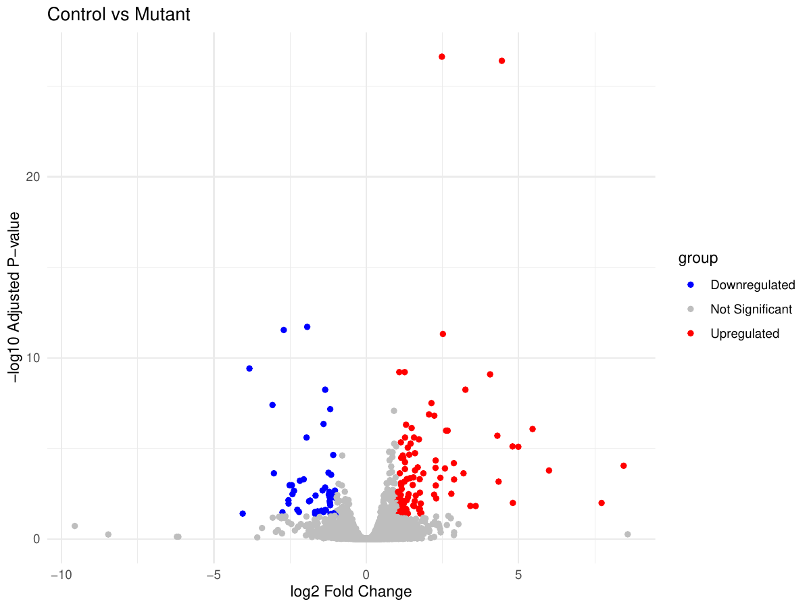
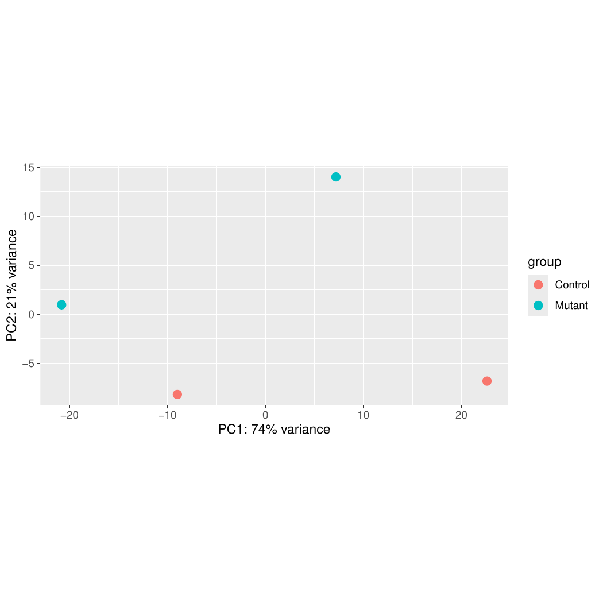
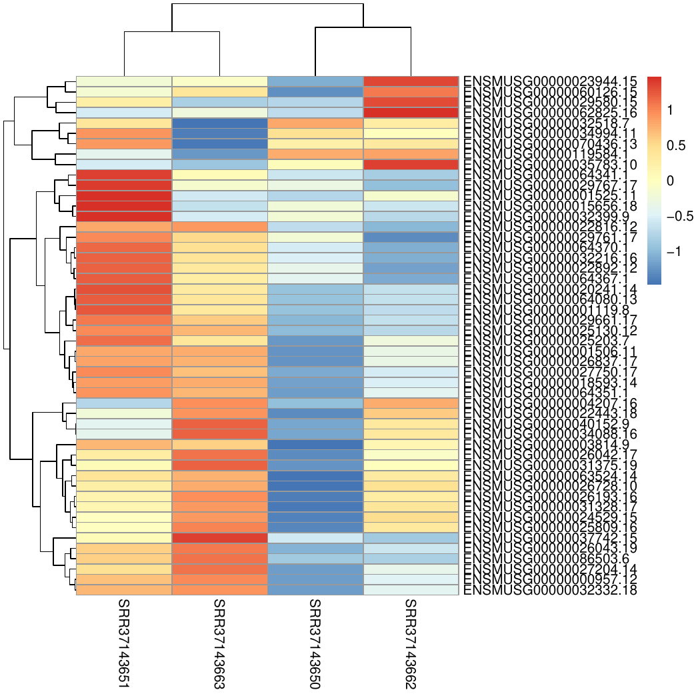

# GSE318685 RNA-seq Differential Expression Analysis

Mus musculus RNA-seq analysis comparing Control vs Mutant samples.

## Samples
| Sample ID | Group |
|-----------|-------|
| SRR37143650 | Mutant |
| SRR37143651 | Control |
| SRR37143662 | Mutant |
| SRR37143663 | Control |

## Functional Annotation and Pathway Enrichment

Performed Gene Ontology (GO) Biological Process and KEGG pathway enrichment analysis on significantly differentially expressed genes using clusterProfiler.

### GO Biological Process Enrichment

### KEGG Pathway Enrichment
- SRR37143650 = Control
- SRR37143651 = Control
- SRR37143662 = Mutant
- SRR37143663 = Mutant

## Pipeline
1. Download SRA files
2. Convert to FASTQ
3. FastQC and MultiQC
4. Trimming with fastp
5. Alignment with HISAT2
6. Counting with featureCounts
7. DESeq2 analysis

## Output
- results/deseq2_results.csv
- results/significant_genes.csv
- results/MA_plot.pdf
- results/PCA_plot.pdf
- results/heatmap_top50.pdf

## Volcano Plot

## PCA Plot

## Heatmap

