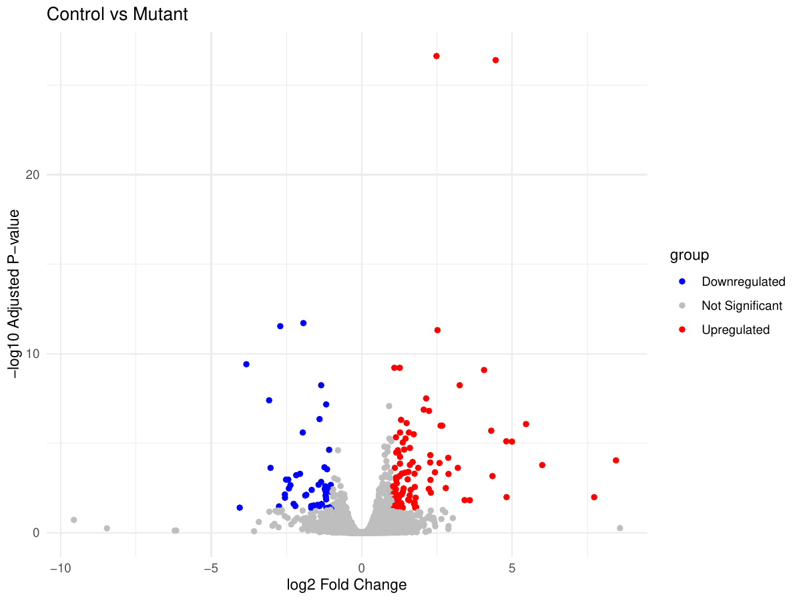
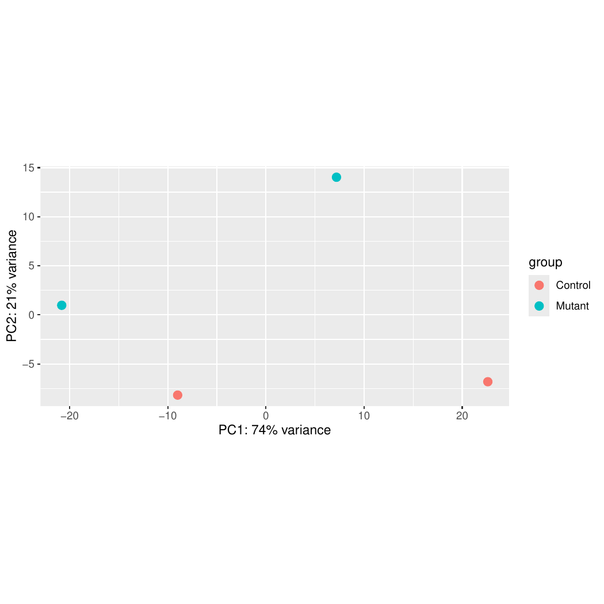
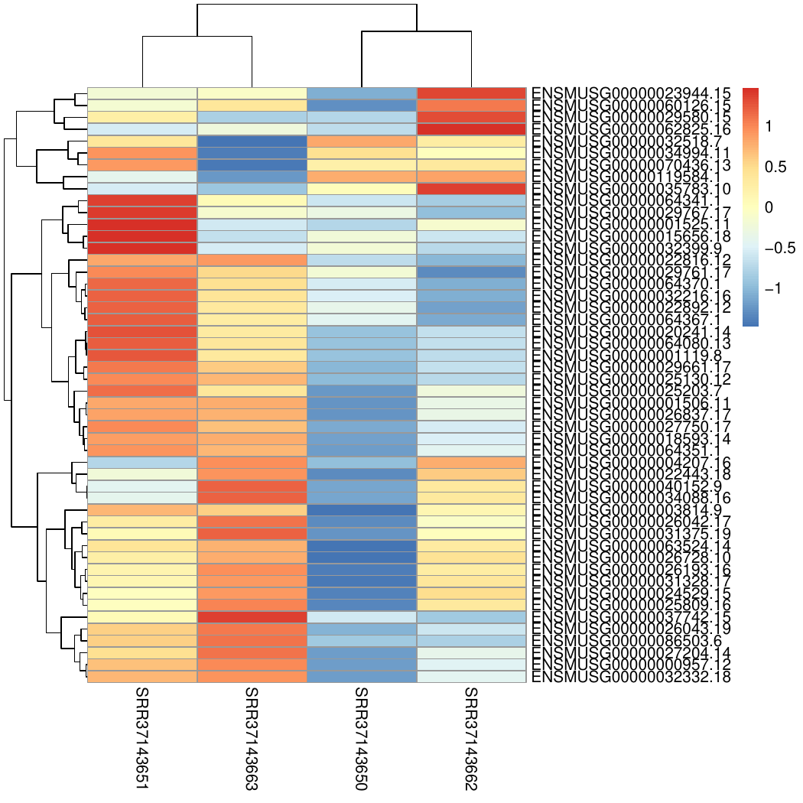
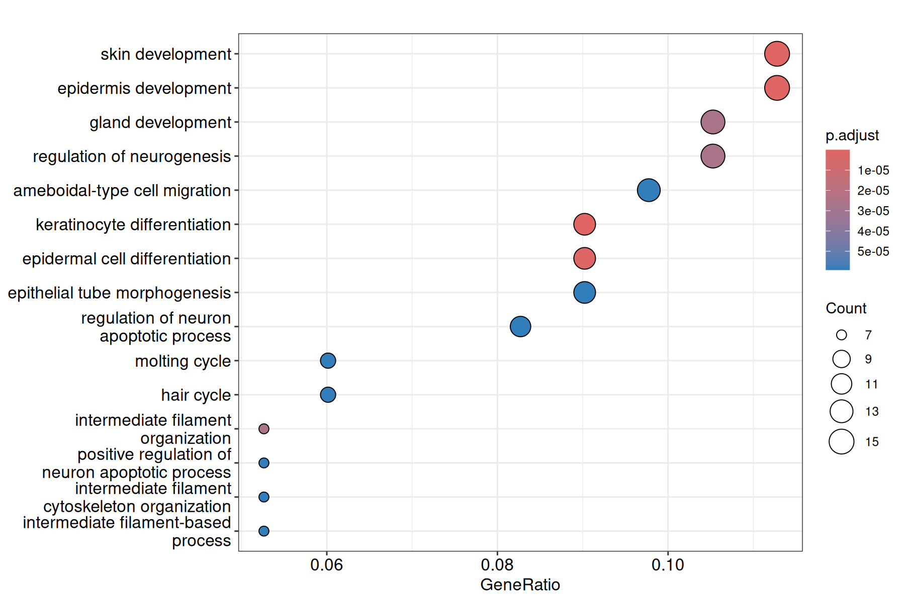
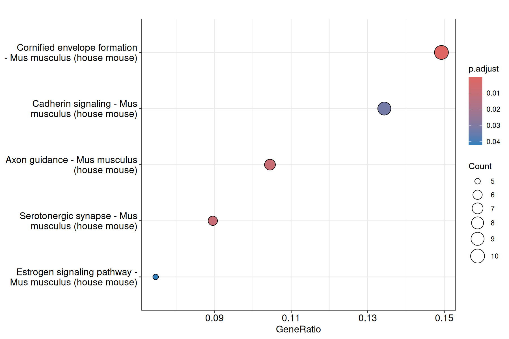
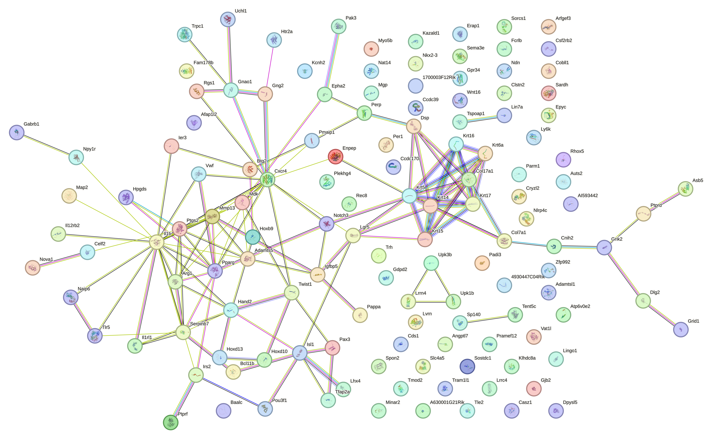
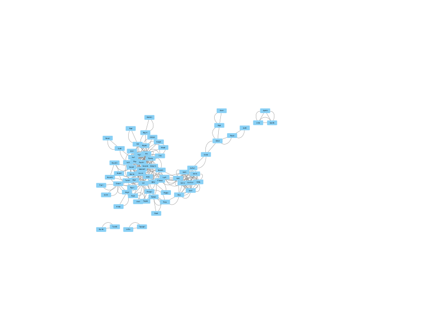
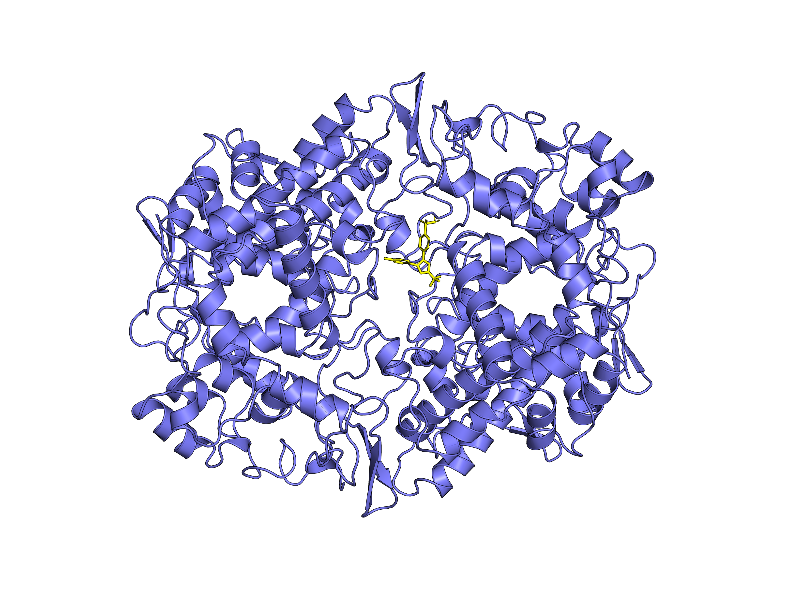
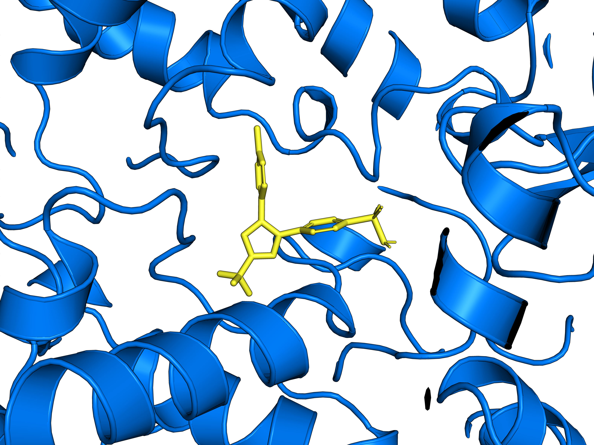
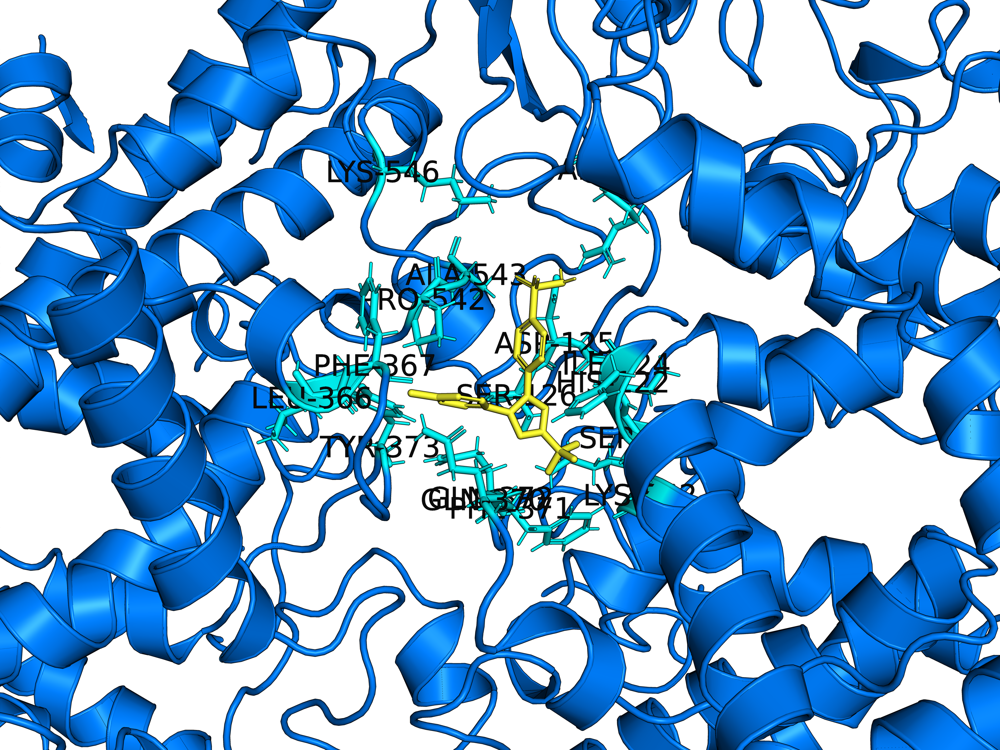

# RNA-Seq Analysis, Network Biology, and Structure-Based Investigation of PTGS2 in *Mus musculus*

An end-to-end bioinformatics project integrating RNA sequencing, functional enrichment, protein interaction network analysis, and molecular docking to identify and evaluate a potential therapeutic target in *Mus musculus*.

---

## Project Overview

RNA sequencing (RNA-seq) is a powerful approach for understanding changes in gene expression under different biological conditions. In this project, I analyzed RNA-seq data from control and mutant *Mus musculus* samples to identify differentially expressed genes and investigate their biological significance.

The analysis began with raw sequencing reads and followed a complete RNA-seq workflow, including quality assessment, read trimming, genome alignment, read quantification, and differential expression analysis. To understand the biological relevance of the identified genes, Gene Ontology (GO) and KEGG pathway enrichment analyses were performed.

To further prioritize biologically important genes, a Protein–Protein Interaction (PPI) network was constructed using STRING and explored in Cytoscape. Based on the network analysis, **PTGS2** was selected for downstream structural investigation. Molecular docking was then performed using AutoDock Vina, followed by structural visualization in PyMOL.

This project demonstrates a complete computational workflow, from raw sequencing data to structural bioinformatics.

---

# Dataset

**Organism:** *Mus musculus*

| Sample ID | Condition |
|-----------|-----------|
| SRR37143650 | Control |
| SRR37143651 | Control |
| SRR37143662 | Mutant |
| SRR37143663 | Mutant |

---

# Project Workflow

```
RNA-seq Data
      │
      ▼
Quality Assessment (FastQC & MultiQC)
      │
      ▼
Read Trimming (fastp)
      │
      ▼
Genome Alignment (HISAT2)
      │
      ▼
Read Quantification (featureCounts)
      │
      ▼
Differential Expression Analysis (DESeq2)
      │
      ▼
GO & KEGG Enrichment
      │
      ▼
Protein–Protein Interaction Network (STRING)
      │
      ▼
Network Visualization (Cytoscape)
      │
      ▼
Hub Gene Selection (PTGS2)
      │
      ▼
Molecular Docking (AutoDock Vina)
      │
      ▼
Structural Visualization (PyMOL)
```

---

# Differential Expression Analysis

Differential gene expression analysis was performed using **DESeq2** to identify genes with significant expression changes between control and mutant samples.

### Volcano Plot



### PCA Plot



### Heatmap



---

# Functional Enrichment Analysis

To understand the biological significance of the differentially expressed genes, Gene Ontology (GO) Biological Process and KEGG pathway enrichment analyses were performed using the **clusterProfiler** package.

### GO Biological Process



### KEGG Pathway Analysis



---

# Protein–Protein Interaction Analysis

A Protein–Protein Interaction (PPI) network was constructed using the STRING database to investigate functional relationships among the differentially expressed genes.

The network was further explored in Cytoscape to visualize interaction patterns and identify highly connected genes that may play important regulatory roles.

### STRING Network



### Cytoscape Network



Based on the combined transcriptomic and network analyses, **PTGS2** was selected as the primary candidate for structural bioinformatics and molecular docking.

---

# Molecular Docking

To evaluate the structural interaction of the selected hub gene, molecular docking was performed using **AutoDock Vina**.

### Best Binding Affinity

**−8.976 kcal/mol**

### Docking Overview



### Binding Pocket


### Protein Surface



### Binding Residues



The docking results indicate a favorable interaction between the ligand and PTGS2, supporting its potential relevance for further computational and experimental investigation.

---

# Repository Structure

```
GSE318685-RNAseq/
│
├── data/
├── fastq/
├── qc/
├── alignment/
├── counts/
├── results/
├── ppi/
├── docking/
├── ligands/
├── structure/
├── visualization/
├── figures_v2/
├── scripts/
├── logs/
└── README.md
```

---

# Software and Tools

- FastQC
- MultiQC
- fastp
- HISAT2
- SAMtools
- featureCounts
- R
- DESeq2
- clusterProfiler
- STRING Database
- Cytoscape
- AutoDock Vina
- PyMOL
- Git & GitHub

---

# Key Outcomes

- Processed raw RNA-seq data through a complete analysis pipeline.
- Identified differentially expressed genes between control and mutant samples.
- Performed GO Biological Process and KEGG pathway enrichment analyses.
- Constructed and analyzed a Protein–Protein Interaction network.
- Prioritized PTGS2 as a biologically significant hub gene.
- Evaluated PTGS2 through molecular docking.
- Generated publication-quality structural visualizations using PyMOL.
- Developed a reproducible bioinformatics workflow integrating transcriptomics and structural biology.

---

# Future Work

Potential extensions of this project include:

- ADMET prediction of docked ligands
- Molecular dynamics simulations
- MM/PBSA binding free energy calculations
- Validation using independent RNA-seq datasets
- Experimental validation of candidate genes

---

# Author

**Prudhvi Teja**

B.Tech in Bioinformatics

Vignan's Foundation for Science, Technology & Research

GitHub: https://github.com/prudhvi-odela

---

## Acknowledgements

The RNA-seq datasets used in this project were obtained from publicly available repositories. All analyses were performed for educational, research, and portfolio development purposes using open-source bioinformatics tools.