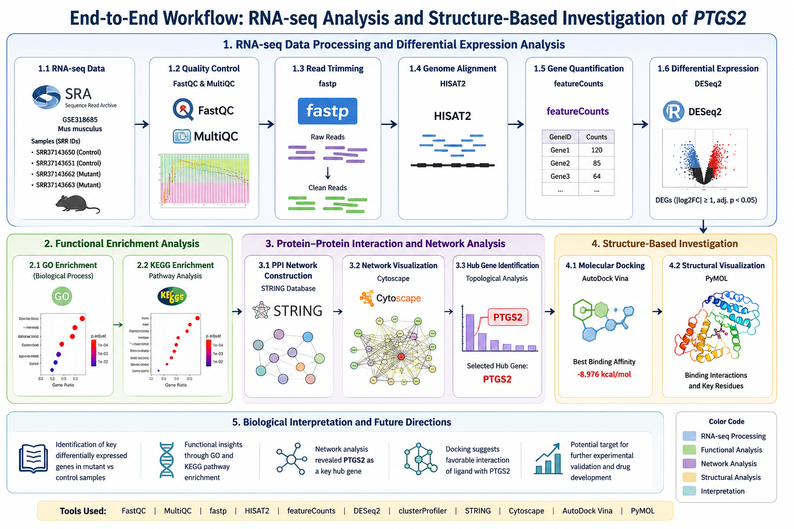
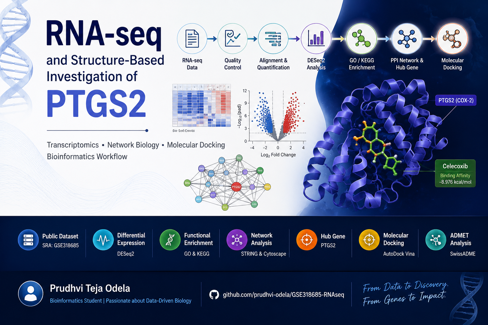
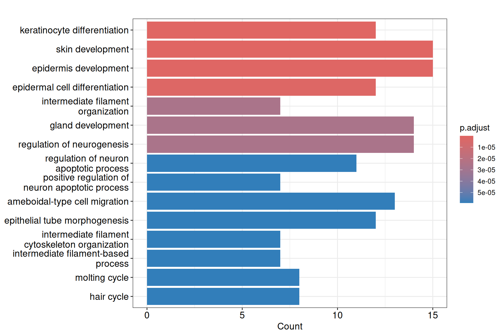
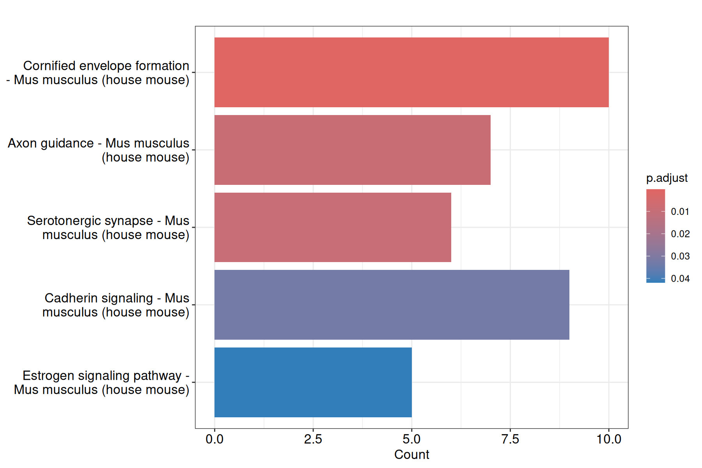
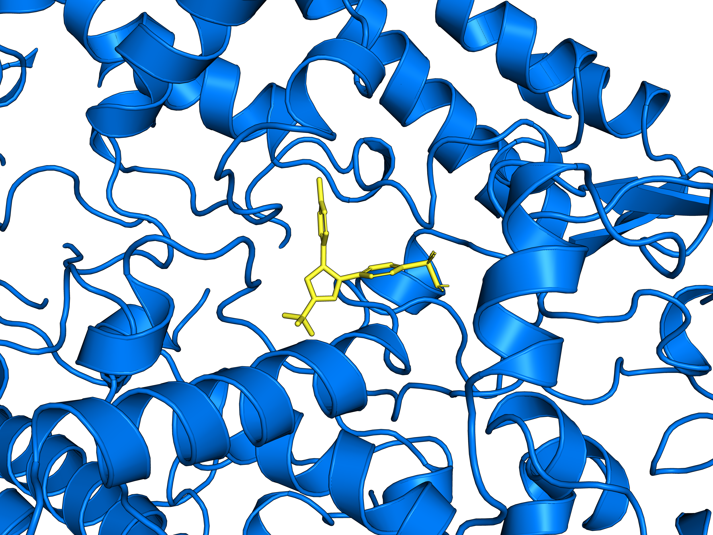
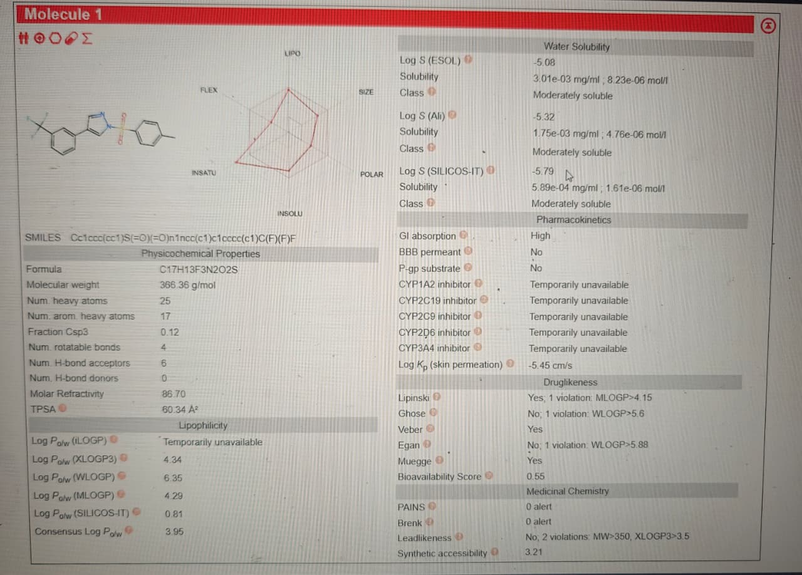

# RNA-Seq Analysis, Network Biology, and Structure-Based Investigation of PTGS2 in *Mus musculus*
> An end-to-end RNA-seq workflow that combines transcriptomics, network biology, and structural bioinformatics to prioritize and investigate PTGS2 in *Mus musculus*.

<p align="center">

</p>

<p align="center">


</p>

---

# Why I Built This Project

Most RNA-seq projects stop after identifying differentially expressed genes. I wanted to go a step further.

For this project, I started with publicly available RNA-seq data from *Mus musculus* and followed the complete analysis workflow—from raw sequencing reads to biological interpretation, protein interaction analysis, molecular docking, and structural visualization.

Instead of treating transcriptomics and structural biology as separate fields, I wanted to connect them in a single reproducible workflow. By combining differential expression analysis with network biology and molecular docking, I explored how computational approaches can be used to prioritize potential therapeutic targets.

The final candidate selected from this workflow was **PTGS2**, which was further investigated using molecular docking and SwissADME analysis.

This repository represents both a complete learning journey and a reproducible bioinformatics pipeline that I plan to build upon in future research projects.

---

# Project Goals

The main objectives of this project were to:

- analyze RNA-seq data from control and mutant samples
- identify differentially expressed genes
- understand their biological functions through GO and KEGG enrichment
- identify important hub genes using protein interaction networks
- investigate PTGS2 using molecular docking
- evaluate the ligand using SwissADME
- organize the entire workflow into a reproducible GitHub repository

---

# Dataset

| Attribute | Information |
|-----------|-------------|
| Organism | *Mus musculus* |
| Data Type | RNA Sequencing |
| Samples | 4 |
| Experimental Design | Control vs Mutant |

### Samples

| Sample | Condition |
|---------|-----------|
| SRR37143650 | Control |
| SRR37143651 | Control |
| SRR37143662 | Mutant |
| SRR37143663 | Mutant |

---

# Project Workflow

<p align="center">

</p>

The workflow begins with raw RNA-seq reads and follows every major analysis step needed to move from sequencing data to biological interpretation and structural investigation.

Rather than treating each analysis independently, every step builds on the results of the previous one—from identifying differentially expressed genes to selecting PTGS2 for molecular docking.

---

# Analysis Pipeline

| Step | Tool |
|------|------|
| Quality Control | FastQC, MultiQC |
| Read Trimming | fastp |
| Alignment | HISAT2 |
| Quantification | featureCounts |
| Differential Expression | DESeq2 |
| Functional Enrichment | clusterProfiler |
| Protein Interaction | STRING |
| Network Visualization | Cytoscape |
| Molecular Docking | AutoDock Vina |
| Structural Visualization | PyMOL |
| ADMET Prediction | SwissADME |

---

# Repository Highlights

- Complete RNA-seq workflow from raw reads to biological interpretation
- Differential expression analysis using DESeq2
- GO and KEGG enrichment analysis
- STRING and Cytoscape network analysis
- Hub gene prioritization
- Molecular docking of PTGS2
- SwissADME drug-likeness analysis
- Reproducible project structure with scripts, figures, and documentation

---

Before diving into downstream analyses, the first step was to identify genes whose expression changed significantly between the control and mutant samples.

---

# Differential Expression Analysis

After preprocessing the RNA-seq data, I used **DESeq2** to compare gene expression between the control and mutant samples.

The goal here was simple: identify genes whose expression changed significantly under the mutant condition. These differentially expressed genes became the starting point for every downstream analysis in this project.

Rather than looking at individual genes in isolation, I wanted to understand the broader biological changes occurring within the dataset.

---

## Principal Component Analysis (PCA)

Before interpreting differential expression results, I first checked whether the samples separated according to their biological condition.

The PCA plot shows that the control and mutant samples cluster separately, suggesting that the observed variation is driven primarily by biological differences rather than technical noise.

<p align="center">

</p>

---

## Volcano Plot

The volcano plot provides an overview of the differential expression results by combining fold change and statistical significance.

Genes appearing farther from the center and above the significance threshold represent the strongest candidates for downstream investigation.

<p align="center">

</p>

---

## Heatmap of Differentially Expressed Genes

To better visualize expression patterns, I generated a heatmap using the most significantly differentially expressed genes.

The clustering pattern clearly distinguishes the control samples from the mutant samples, providing another indication that the biological conditions have distinct transcriptional profiles.

<p align="center">

</p>

---

# Functional Enrichment Analysis

Finding differentially expressed genes is only the beginning.

The next question I wanted to answer was:

**What biological processes are changing?**

To explore this, I performed Gene Ontology (GO) and KEGG pathway enrichment analyses using **clusterProfiler**.

These analyses help move beyond individual genes and reveal which biological pathways are collectively affected.

---

## Gene Ontology (GO)

The GO analysis highlights biological processes that are enriched among the differentially expressed genes.

Instead of focusing on single genes, this analysis provides a broader view of the cellular functions most influenced by the mutant condition.

<p align="center">

</p>

The bar plot below presents the same enriched terms from another perspective, making it easier to compare their relative significance.

<p align="center">

</p>

---

## KEGG Pathway Analysis

To complement the GO analysis, I also explored pathway-level changes using the KEGG database.

This helped identify signaling and metabolic pathways that may contribute to the observed transcriptional differences.

<p align="center">

</p>

The accompanying bar plot summarizes the most significantly enriched pathways.

<p align="center">

</p>

---

# Protein–Protein Interaction Network

Gene expression alone does not always reveal which genes are the most biologically important.

To identify key regulators, I constructed a Protein–Protein Interaction (PPI) network using the **STRING** database.

This allowed me to examine how the differentially expressed genes interact with one another and identify genes that occupy central positions within the network.

---

## STRING Network

The STRING network illustrates predicted and experimentally supported interactions among the significant genes.

Highly connected regions often represent proteins involved in shared biological functions or regulatory processes.

<p align="center">

</p>

---

## Network Visualization in Cytoscape

To explore the interaction network in more detail, I imported it into **Cytoscape**.

Visualizing the network in Cytoscape made it easier to identify highly connected nodes and inspect the overall network organization.

<p align="center">

</p>

---

# Why PTGS2?

After combining the transcriptomic results with the network analysis, **PTGS2** stood out as one of the most biologically relevant hub genes.

Instead of selecting a target based only on fold change, I considered both its differential expression and its importance within the interaction network.

Because PTGS2 is well known for its role in inflammatory pathways and disease biology, I selected it for the next stage of the project: structural analysis and molecular docking.

---

# Structure-Based Investigation of PTGS2

Once PTGS2 emerged as a promising hub gene from the transcriptomic and network analyses, I wanted to explore it from a structural perspective.

The idea was to move one step beyond gene expression and investigate whether PTGS2 could also be a reasonable target for small-molecule interaction. To do this, I performed molecular docking using **AutoDock Vina** and visualized the results in **PyMOL**.

Although molecular docking alone cannot confirm biological activity, it provides useful insight into how a ligand might interact with the target protein and serves as a good starting point for future studies.

---

# Molecular Docking

For the docking study, I selected **Celecoxib**, a well-known COX-2 inhibitor, as the reference ligand because PTGS2 encodes the COX-2 enzyme.

Using a known inhibitor allowed me to explore the binding pocket of PTGS2 and evaluate whether the predicted binding pose agreed with what is already known about this therapeutic target.

---

## Docking Summary

| Property | Result |
|----------|--------|
| Target Protein | PTGS2 |
| Ligand | Celecoxib |
| Docking Software | AutoDock Vina |
| Visualization | PyMOL |
| Best Binding Affinity | **−8.976 kcal/mol** |

The predicted binding affinity indicates a favorable interaction between Celecoxib and PTGS2 under the docking conditions used in this project.

---

## Protein–Ligand Complex

The complete docked complex provides an overview of how the ligand fits within the protein structure before examining individual interactions.

<p align="center">

</p>

---

## Binding Pocket

A closer look at the binding pocket shows how the ligand occupies the active region of PTGS2.

This view helps illustrate the spatial relationship between the ligand and the residues surrounding the binding site.

<p align="center">

</p>

---

## Surface Representation

Viewing the protein surface provides another perspective on ligand accessibility and how deeply the ligand is positioned within the binding pocket.

<p align="center">

</p>

---

## Binding Residues

To better understand the predicted interaction, I visualized the residues surrounding the ligand in PyMOL.

These residues define the local binding environment and help explain the observed docking pose.

<p align="center">

</p>

---

## Publication Figure

As a final visualization, I prepared a publication-style figure summarizing the protein–ligand interaction.

<p align="center">

</p>

---

# Drug-Likeness and ADMET Evaluation

Docking provides information about binding, but it does not tell us whether a compound has properties that are generally desirable for a drug.

To complement the docking analysis, I evaluated Celecoxib using **SwissADME**, which predicts physicochemical properties, pharmacokinetic characteristics, and common drug-likeness rules.

This additional step provides a broader view of the ligand beyond its predicted binding affinity.

<p align="center">

</p>

### Summary of SwissADME Results

| Property | Observation |
|----------|-------------|
| Gastrointestinal Absorption | High |
| Bioavailability Score | 0.55 |
| Drug-likeness | Favorable |
| Lipinski Rule | Passed (1 violation) |
| PAINS Alerts | None |
| Brenk Alerts | None |

Overall, the SwissADME results are consistent with the known pharmacological profile of Celecoxib and provide additional support for its suitability as a reference ligand in this study.

---

# What I Learned

One of the main goals of this project was to connect multiple areas of bioinformatics into a single workflow.

Rather than stopping after identifying differentially expressed genes, I wanted to understand how transcriptomic findings could be extended into network biology and structural bioinformatics.

Working through this project strengthened my understanding of:

- RNA-seq analysis using DESeq2
- Functional enrichment analysis
- Protein interaction network analysis
- Hub gene prioritization
- Molecular docking workflows
- Protein visualization in PyMOL
- Drug-likeness assessment using SwissADME

More importantly, it showed me how these individual analyses fit together to answer a biological question rather than existing as separate computational techniques.

---

The workflow is fully reproducible, and all scripts, processed data, figures, and documentation are included in this repository.

---

# Repository Structure

The repository is organized so that each stage of the workflow can be explored independently while still fitting into the complete analysis pipeline.

```text
GSE318685-RNAseq/
│
├── admet/                  # SwissADME analysis
├── counts/                 # Count matrix and sample metadata
├── docking/                # AutoDock Vina files
├── docs/                   # Additional documentation
├── figures_v2/             # Publication-quality figures
├── hub_genes/              # Hub gene analysis
├── interpretation/         # Biological interpretation
├── ligands/                # Ligand structures
├── literature/             # Supporting literature
├── logs/                   # Project progress logs
├── ppi/                    # Protein interaction analysis
├── report/                 # Reports and summaries
├── results/                # RNA-seq analysis outputs
├── scripts/                # Analysis scripts
├── star_index/             # Genome index
├── structure/              # Protein structures
├── visualization/          # PyMOL sessions and images
│
├── CHANGELOG.md
├── CITATION.cff
├── LICENSE
├── PROJECT_PLAN.md
├── ROADMAP.md
└── README.md
```

---

# Software and Resources

### RNA-seq Analysis

- FastQC
- MultiQC
- fastp
- HISAT2
- featureCounts
- SAMtools
- DESeq2

### Functional Analysis

- clusterProfiler
- enrichplot
- org.Mm.eg.db
- ggplot2

### Network Biology

- STRING Database
- Cytoscape

### Structural Bioinformatics

- AutoDock Vina
- PyMOL
- SwissADME

### Development Environment

- Ubuntu (WSL)
- Git
- GitHub
- R

---

# Key Outcomes

Through this project, I was able to:

- identify differentially expressed genes between control and mutant samples
- interpret transcriptomic changes using GO and KEGG enrichment analyses
- construct and visualize a protein–protein interaction network
- prioritize PTGS2 as a biologically relevant hub gene
- investigate PTGS2 through molecular docking with Celecoxib
- evaluate ligand drug-likeness using SwissADME
- organize the entire workflow into a reproducible and well-documented GitHub repository

---

# Future Directions

This project marks the beginning of a broader journey into computational biology and bioinformatics research.

Some of the directions I plan to explore next include:

- Molecular Dynamics (MD) simulations to study protein stability after docking
- MM/PBSA free energy calculations
- Comparative transcriptomic analyses across multiple datasets
- Multi-omics integration for biomarker discovery
- Machine learning approaches for target prioritization
- Experimental validation of computational findings through published literature and future collaborations

As I continue learning, I plan to expand this repository with additional analyses and improve the workflow based on new techniques and research experience.

---

# Reproducibility

All analyses in this repository were carried out using publicly available datasets and open-source software.

The repository includes:

- analysis scripts
- processed datasets
- differential expression results
- enrichment analyses
- network analysis files
- docking outputs
- PyMOL visualizations
- publication-quality figures
- supporting documentation

My goal was to make the workflow easy to understand, reproduce, and build upon for anyone interested in transcriptomics and computational biology.

---

# Citation

If you find this repository useful in your work or research, please consider citing it using the information provided in **CITATION.cff**.

```text
Odela, P. T.
RNA-Seq Analysis, Network Biology, and Structure-Based Investigation of PTGS2 in Mus musculus.
GitHub Repository.
```

---

# About Me

Hi! I'm **Prudhvi Teja**, a Bioinformatics undergraduate with a strong interest in transcriptomics, computational biology, and AI-driven approaches for biological research.

I enjoy building end-to-end bioinformatics workflows that combine data analysis, biological interpretation, and structural investigation. Each project helps me explore a new area of computational biology while strengthening my practical research skills.

I'm currently expanding my work into single-cell analysis, multi-omics integration, and AI-assisted biomarker discovery, with the long-term goal of contributing to impactful research in bioinformatics.

**GitHub:** https://github.com/prudhvi-odela

---

# Acknowledgements

This project uses publicly available RNA-seq datasets together with open-source bioinformatics software developed by the scientific community.

I would like to thank the developers and maintainers of these tools and databases for making high-quality computational biology research more accessible.

---

## License

This project is released under the **MIT License**. See the `LICENSE` file for more information.
